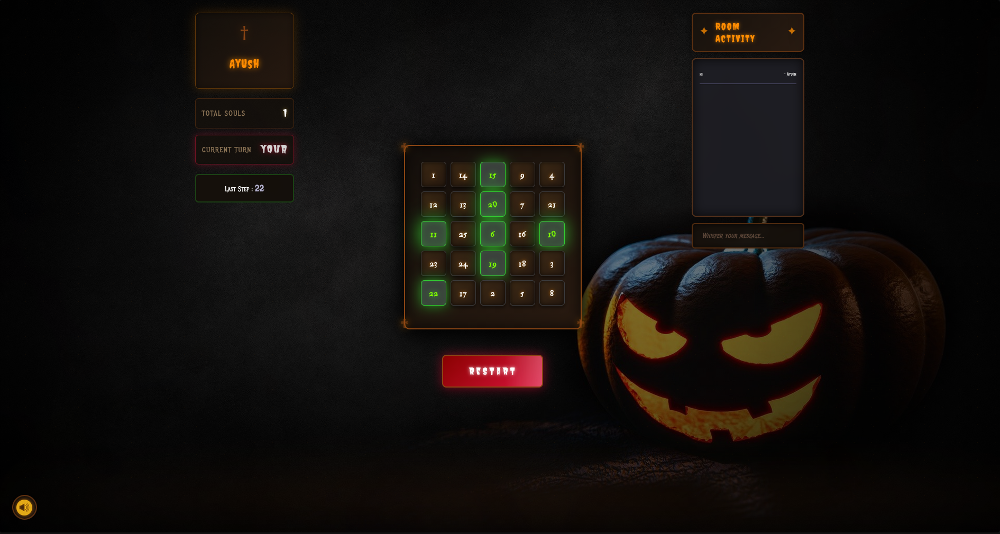
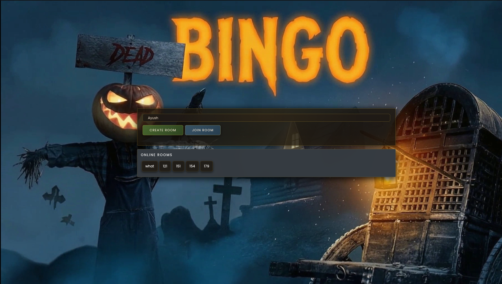

# 🎮 Django Channels Bingo Game

A real-time multiplayer Bingo game built with Django Channels and JavaScript. Play the classic paper Bingo game with friends online in a spooky horror-themed cinematic experience.


## 📸 Screenshots

### Home Page


### Create/Join Room


### Enter Name


## ✨ Features

- **Real-time Multiplayer** - Play with friends in real-time using WebSockets
- **Room System** - Create custom rooms and invite friends to join
- **Live Sync** - Tile clicks, Bingo calls, and game state sync instantly across all players
- **In-Game Chat** - Chat with other players in the room
- **Horror Theme** - Spooky cinematic UI with custom fonts and atmospheric effects
- **Background Music** - Toggle-able atmospheric audio
- **Responsive Design** - Works on desktop, tablet, and mobile devices
- **Auto Cleanup** - Rooms are automatically deleted when all players leave

## 🛠️ Tech Stack

- **Backend**: Django 4.0+ with Django Channels
- **WebSocket**: Daphne ASGI server
- **Database**: SQLite3
- **Frontend**: HTML5, CSS3, JavaScript (Vanilla)
- **Real-time**: WebSockets via channels

## 🚀 Quick Start

### Prerequisites

- Python 3.8+
- pip

### Installation

```bash
# Clone the repository
git clone https://github.com/yourusername/django-channels-bingo-game.git
cd django-channels-bingo-game

# Create virtual environment
python3 -m venv venv
source venv/bin/activate  # Linux/Mac
# venv\Scripts\activate   # Windows

# Install dependencies
pip install -r requirements.txt

# Run migrations
python manage.py migrate

# Start the server
daphne -b 0.0.0.0 -p 8000 mainproject.asgi:application
```

### Or use the automated script

```bash
bash setup_and_run.sh
```

## 📱 Access the Game

- **Local**: http://localhost:8000
- **Network**: http://YOUR_IP:8000 (for other devices on the same network)

## 🎯 How to Play

1. Enter your name on the landing page
2. Create a new room or join an existing one
3. Share the room URL with friends
4. The classic 5x5 Bingo grid - mark tiles as numbers are called
5. Get 5 in a row (horizontal, vertical, or diagonal) to call BINGO!
6. First player to get Bingo wins

## 📂 Project Structure

```
django_channels_bingo_game/
├── bingo/                    # Main game app
│   ├── models.py            # BingoRoom, TrackPlayers models
│   ├── views.py             # Django views
│   ├── consumers.py         # WebSocket consumers
│   ├── routing.py           # WebSocket routing
│   ├── templates/          # HTML templates
│   └── static/             # CSS, JS, assets
├── mainproject/             # Django project settings
│   ├── settings.py         # Django settings
│   ├── asgi.py            # ASGI config
│   └── urls.py            # URL routing
├── static/                  # Static files
├── manage.py               # Django management
└── requirements.txt        # Python dependencies
```

## 🔧 WebSocket Commands

| Command | Description |
|---------|-------------|
| `joined` | Player joined notification |
| `clicked` | Tile click sync |
| `won` | Bingo win declaration |
| `chat` | Chat message |

## 🌐 Deployment

For production deployment:

```bash
# Set DEBUG to False in settings.py
# Use a production database (PostgreSQL recommended)
# Use Redis as the channel layer:

# requirements.txt additions:
pip install channels_redis

# settings.py CHANNEL_LAYERS:
CHANNEL_LAYERS = {
    "default": {
        "BACKEND": "channels_redis.core.RedisChannelLayer",
        "CONFIG": {
            "hosts": [("127.0.0.1", 6379)],
        },
    }
}
```

## 📝 License

MIT License - feel free to use and modify!

## 🙏 Acknowledgments

- Django Channels documentation
- Classic paper Bingo game from school days

---

<p align="center">
  <sub>Made with ❤️ using Django Channels</sub>
</p>
